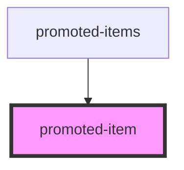

# promoted-item

<!-- Auto Generated Below -->

## Properties

| Property          | Attribute | Description | Type     | Default     |
| ----------------- | --------- | ----------- | -------- | ----------- |
| `id` _(required)_ | `id`      |             | `string` | `undefined` |

## Events

| Event     | Description | Type                  |
| --------- | ----------- | --------------------- |
| `removed` |             | `CustomEvent<string>` |
| `saved`   |             | `CustomEvent<string>` |

## Dependencies

### Used by

 - [promoted-items](..\promoted-items)

### Graph

----------------------------------------------

*Built with [StencilJS](https://stenciljs.com/)*
