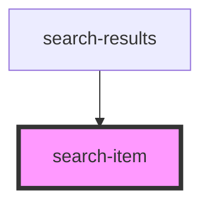

# search-item

<!-- Auto Generated Below -->

## Properties

| Property              | Attribute | Description | Type            | Default     |
| --------------------- | --------- | ----------- | --------------- | ----------- |
| `record` _(required)_ | --        |             | `ISearchResult` | `undefined` |

## Events

| Event     | Description | Type                         |
| --------- | ----------- | ---------------------------- |
| `removed` |             | `CustomEvent<ISearchResult>` |
| `saved`   |             | `CustomEvent<ISearchResult>` |

## Dependencies

### Used by

 - [search-results](..\search-results)

### Graph

----------------------------------------------

*Built with [StencilJS](https://stenciljs.com/)*
