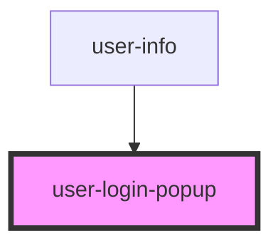

# user-login-popup

<!-- Auto Generated Below -->

## Properties

| Property  | Attribute | Description | Type      | Default |
| --------- | --------- | ----------- | --------- | ------- |
| `visible` | `visible` |             | `boolean` | `false` |

## Events

| Event      | Description | Type                 |
| ---------- | ----------- | -------------------- |
| `closed`   |             | `CustomEvent<void>`  |
| `loggedIn` |             | `CustomEvent<IUser>` |

## Dependencies

### Used by

 - [user-info](..\user-info)

### Graph

----------------------------------------------

*Built with [StencilJS](https://stenciljs.com/)*
